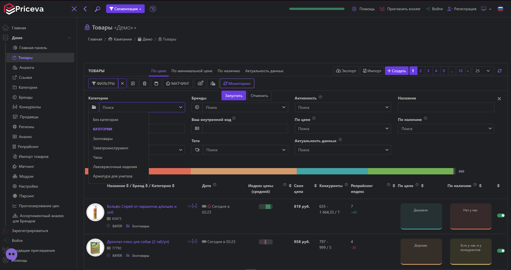
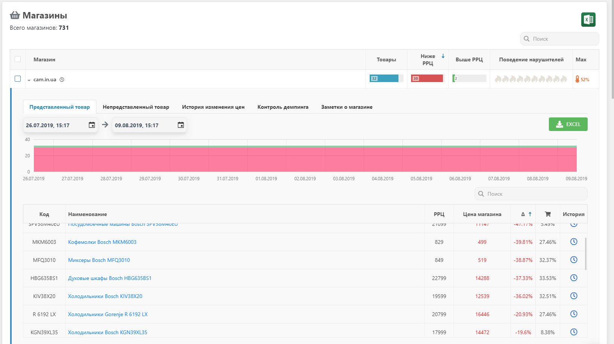
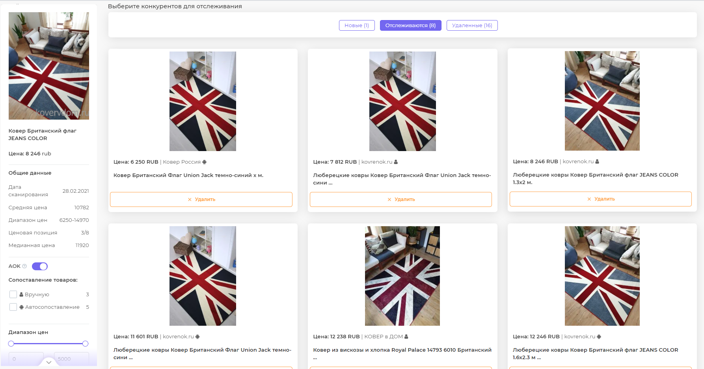
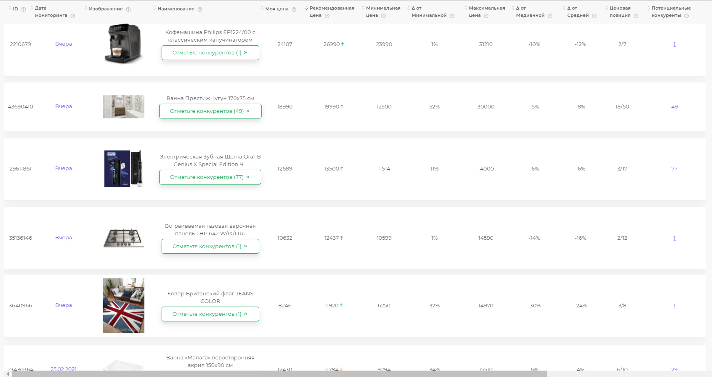

Тема: Разработка инструмента для анализа цен конкурентов и ключевых стройматериалов в строительной компании Alex Group

Компания не знает точных и актуальных цен на материалы и конкурентов - из-за этого теряет деньги.

Проще:

- цены на стройматериалы постоянно меняются
- конкуренты могут быть дешевле
- смета может «развалиться»

В итоге:

- либо компания продаёт слишком дешево - теряет прибыль
- либо слишком дорого - теряет клиентов

Существующие решения:

СНГ:

Priceva - это автоматизированная платформа для мониторинга цен и анализа конкурентов в сфере электронной коммерции. Она помогает ритейлерам и производителям отслеживать цены конкурентов, управлять собственным ценообразованием и анализировать рыночные тенденции.

 Услуги, которые предоставляет сервис:

Z-PRICE - российская компания, предоставляющая облачные сервисы для мониторинга цен, анализа рынка и управления ценообразованием в онлайн- и офлайн-ритейле. Платформа используется крупными торговыми сетями и брендами для автоматизации конкурентного анализа и оптимизации стратегии продаж.

Z-PRICE предлагает автоматизированный сбор данных о ценах и наличии товаров в онлайн-магазинах конкурентов. Система использует парсинг, искусственный интеллект и алгоритмы сопоставления SKU для анализа ценовых стратегий. Клиенты могут получать отчёты в реальном времени, строить дашборды и интегрировать данные с внутренними ERP-системами. Но на сервисе также отсутствуют цены на стройматериалы.

UXprice - это компания-разработчик SaaS-платформы для мониторинга и анализа цен в электронной коммерции, работающая преимущественно на рынках стран СНГ. Сервис помогает интернет-ритейлерам и брендам отслеживать динамику цен конкурентов, оптимизировать собственную ценовую политику и управлять ассортиментом.

Небольшие выводы:

Priceva прямо пишет, что может мониторить цены конкурентов на тысячах сайтов, включая сложные сайты, и ориентируется не только на ритейл, но и на дистрибьюторов; у них есть отслеживание цен, наличия, скидок и алерты. 
 Z-PRICE пишет, что работает с 40 000+ сайтов, собирает данные 24/7, обновляет их каждые 2–3 часа и умеет подбирать товары по бренду, названию, артикулу и другим признакам. 
 uXprice тоже умеет мониторить товары по ссылкам и указанным сайтам, но сам себя позиционирует как решение именно для онлайн-магазинов, брендов и дистрибьюторов, где есть карточки товаров и ассортимент.

Вопрос: «Могут ли данные сервисы справится с нашей задачей?»

- Могут, но частично если речь о стройматериалах в обычных интернет-магазинах, то да - такие сервисы часто действительно могут это мониторить:

- если есть карточка товара,
- цена открыта,
- товар можно сопоставить по названию, артикулу, бренду или ссылке.

НО! Сайт конкурента по домам под ключ — это уже не типичный интернет-магазин. 
 Там часто нет:

- нормальной карточки товара,
- одинакового артикула,
- одинаковой комплектации,
- прозрачной цены.

У одного конкурента будет «дом 120 м² от 5,2 млн», у другого — «от 4,8 млн», но без фундамента, у третьего — «тёплый контур», у четвёртого — «под ключ». 
Технически сервис, возможно, и сможет снять страницу или цену, но бизнес-сравнение всё равно останется кривым, пока кто-то не приведёт всё к единому виду. Это уже не просто “парсинг”, а нормализация и сравнение предложений. Это и есть твоя ниша.

- «Тогда что же остается сделать мне как разработчику?»

Не нужно соревноваться с Priceva/Z-PRICE/uXprice и писать приложение в духе «сделаю сервис, который парсит любые сайты». Это нереально и не нужно. Обычно у таких компаний есть СВОЙ небольшой список поставщиков и конкурентов. Тогда задача приобретает такой смысл: «Cделать узкий и полезный инструмент именно для строительной компании»

## Какие стройматериалы мониторить?

## 1. Брус (строительный)

Единица: м³ 
Почему: основа каркасных и деревянных домов

## 2. Доска обрезная

Единица: м³ 
Почему: используется везде (каркас, крыша, перекрытия)

## 3. OSB-плита

Единица: лист 
Почему: стандартный материал → идеально для сравнения

## 4. Минеральная вата

Единица: м² / упаковка 
Почему: критично для Сахалина

## 5. Пенополистирол (пенопласт)

Единица: м² 
Почему: альтернатива утеплителю → важно сравнивать

## 6. Бетон (М200–М300)

Единица: м³ 
Почему: фундамент = база дома

## 7. Арматура

Единица: тонна / метр 
Почему: всегда идет вместе с бетоном

## 8. Металлочерепица

Единица: м² 
Почему: популярный кровельный материал

## 9. Пластиковые окна (ПВХ)

Единица: штука / м² 
Почему: легко сравнивать + влияет на цену дома

## 10. Профнастил

Единица: м² 
Почему: используется для крыши, заборов, хозпостроек

Сайты для отслеживания стройматериалов: 
1. Стройландия: [https://stroylandiya.ru](https://stroylandiya.ru/)

Описание: Крупная сеть стройматериалов (есть доставка на Дальний Восток).

2. Петрович: [https://rf.petrovich.ru](https://rf.petrovich.ru/)

Описание: Один из крупнейших поставщиков стройматериалов в РФ.

3. Эко газоблок :[https://agb65.ru/#popup:subscription](https://agb65.ru/#popup:subscription)

4. Лемано про: [https://lemanapro.ru/?utm_referrer=https%3A%2F%2Flemanapro.ru%2Ffaq%2Foplata-zakazov-na-sayte%2F](https://lemanapro.ru/?utm_referrer=https%3A%2F%2Flemanapro.ru%2Ffaq%2Foplata-zakazov-na-sayte%2F)

Цены конкурентов (дома под ключ):

1. Авито

2. 2Гис

# Cтек технологий

## 1) Язык и бэкенд

Python + FastAPI

Почему:

- Python удобен для парсинга
- FastAPI простой для API и админки
- у него есть автоматическая документация /docs, и он позиционируется как быстрый и удобный для production и обучения.

Для тебя это хороший вариант, потому что:

- один язык на всё
- легко сделать API
- легко потом прикрутить фронт или Telegram-бота

## 2) Парсинг

### Для простых сайтов:

aiohttp + BeautifulSoup 
Подходит, если:

- страница обычная
- цена есть в HTML
- нет сложной подгрузки

## 3) База данных

PostgreSQL

Почему:

- нормальная взрослая БД
- подходит для истории цен
- удобно делать фильтры, отчёты, сравнение по датам

PostgreSQL официально описывается как зрелая open-source реляционная СУБД с хорошей надёжностью и документацией.

Для совсем первого прототипа можно даже начать с SQLite, но если хочешь что-то похожее на рабочее приложение — лучше сразу PostgreSQL.

## 4) Работа с БД из Python

SQLAlchemy

Это стандартный инструмент для работы с БД из Python; в официальной документации он описан как SQL toolkit и ORM.

Тебе он даст:

- модели таблиц
- меньше ручного SQL
- удобство в FastAPI

## 5) Расписание задач

APScheduler

Он нужен, чтобы:

- каждый день собирать цены
- раз в неделю обновлять конкурентов
- делать ночной пересчёт

В официальной документации APScheduler прямо сказано, что он нужен для запуска Python-кода позже или по расписанию, в том числе регулярно.

## 7) Интерфейс

### Вариант А — самый реалистичный

FastAPI + Jinja2 
То есть:

- простая веб-страница
- таблицы
- фильтры
- кнопка “обновить”

## 8) Уведомления

Telegram Bot API или email 
Для MVP хватит:

- Telegram-уведомления
- email-отчёт раз в неделю
- Например:

- “У конкурента цена изменилась”
- “Газоблок вырос на 8%”
- “OSB дешевле у поставщика X”

## Модули программы

## Модуль 1. Источники

- список сайтов
- настройки парсинга
- частота обновления

## Модуль 2. Парсеры

- отдельный парсер на каждый сайт
- общий интерфейс parse_site()

## Модуль 3. Нормализация

- приведение названий
- единицы измерения
- цена за м²
- сопоставление материалов

## Модуль 4. БД

Таблицы:

- suppliers
- competitors
- materials
- material_prices
- house_projects
- competitor_prices
- parsing_logs

## Модуль 5. Аналитика

- сравнение
- графики
- алерты

## Модуль 6. UI/API

- просмотр данных
- фильтры
- отчёты
- ручной запуск обновления
